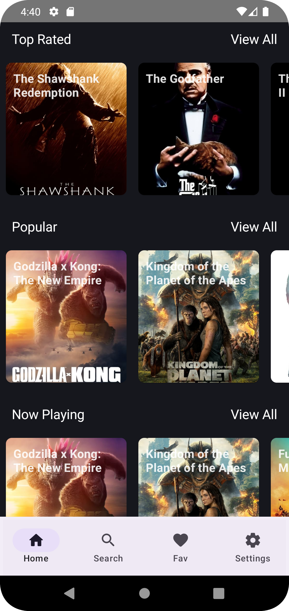
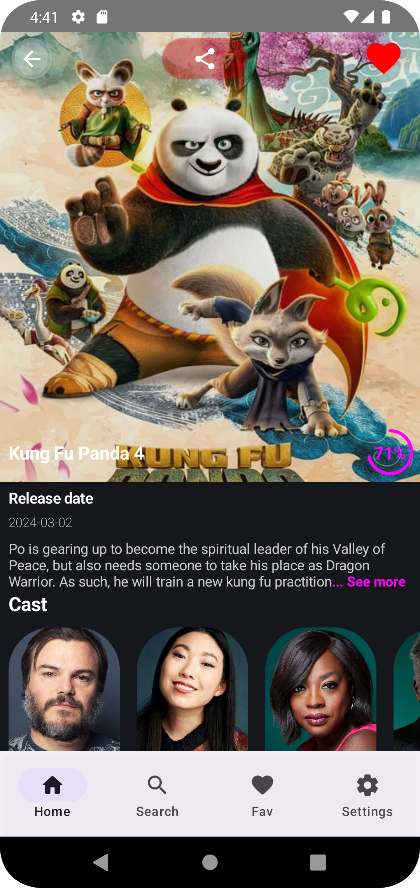
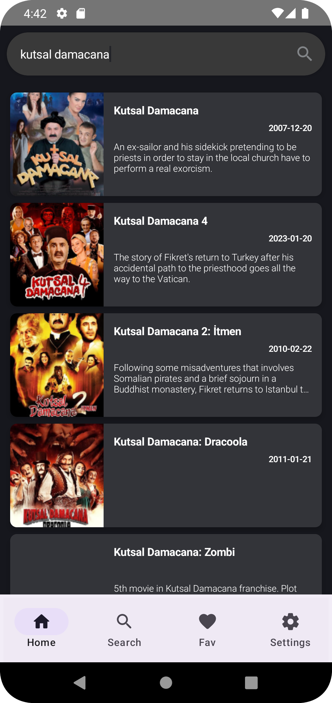

# 🎬 The Movie App

**The Movie App**, kullanıcıların popüler filmleri keşfetmesini, detaylarını incelemesini ve favorilerini yönetmesini sağlayan, **Clean Architecture** ve **MVVM** prensiplerine sadık kalınarak geliştirilmiş modern bir Android uygulamasıdır.

Bu proje, **TMDB (The Movie Database) API** verilerini kullanarak dinamik ve akıcı bir kullanıcı deneyimi sunar.

## 📱 Ekran Görüntüleri ve Demo

Uygulamanın arayüzünden kareler ve özellikler:

| Giriş / Splash | Ana Sayfa | Film Detayı |
|:---:|:---:|:---:|
|  |  |  |

| Arama / Liste | Profil / Ayarlar | 🎥 Canlı Demo |
|:---:|:---:|:---:|
|  |  | **[▶️ Videoyu İzle](Screenshots/Screen_recording_youtube.webm)**<br>*(WebM formatında kayıt)* |

## ✨ Temel Özellikler

* **Firebase Authentication:** Email/Şifre ile güvenli giriş ve kayıt.
* **Misafir Girişi (Guest User):** Kayıt olmadan uygulamayı keşfetme imkanı (Son güncelleme ile eklendi).
* **Film Keşfi:** Popüler, vizyondaki ve yüksek puanlı filmleri listeleme.
* **Detaylı Görünüm:** Oyuncular, özet, yayın tarihi ve puan bilgileri.
* **Özel Animasyonlar:** Kullanıcı deneyimini artıran özel yükleme (loading) animasyonları.
* **Arama Modülü:** Geniş veritabanında film arama.

## 🛠️ Teknoloji Yığını (Tech Stack)

Proje, modern Android geliştirme standartlarına uygun olarak inşa edilmiştir:

* **Dil:** Kotlin
* **Mimari:** MVVM (Model-View-ViewModel) & Clean Architecture
* **UI:** XML / ViewBinding
* **Ağ (Network):** Retrofit & OkHttp
* **Asenkron İşlemler:** Coroutines & Flow
* **Veri Yönetimi:** Firebase (Auth & Firestore)
* **Görsel Yükleme:** Glide / Coil
* **Dependency Injection:** Hilt (veya Koin - *kullandığına göre düzenleyebilirsin*)
* **Navigasyon:** Android Navigation Component

## 🚀 Kurulum

Projeyi yerel ortamınızda çalıştırmak için:

1.  Repoyu klonlayın:
    ```bash
    git clone [https://github.com/SalihT95/The-Movie-App.git](https://github.com/SalihT95/The-Movie-App.git)
    ```
2.  Android Studio'da projeyi açın (`File > Open`).
3.  `build.gradle` dosyalarının senkronize olmasını bekleyin.
4.  **Önemli:** TMDB API anahtarınızı `local.properties` veya ilgili sabitler dosyasına eklediğinizden emin olun.
5.  Uygulamayı emülatörde veya fiziksel cihazda çalıştırın.

## 📞 İletişim

**Geliştirici:** Salih Türkoğlu
* GitHub: [@SalihT95](https://github.com/SalihT95)
* Web: [salihturkoglu.dev](https://salihturkoglu.dev)

---
*Bu proje açık kaynaklıdır ve eğitim amaçlı geliştirilmiştir.*
