# 🎬 MovieAppCompose

**MovieAppCompose**, Android dünyasının en güncel teknolojisi olan **Jetpack Compose** ile geliştirilmiş, **Clean Architecture** ve **MVVM** prensiplerine tam uyumlu modern bir film keşif uygulamasıdır.

XML kullanılmadan tamamen **Declarative UI** yaklaşımıyla yazılan bu proje, **TMDB (The Movie Database) API** verilerini kullanarak kullanıcılara zengin bir içerik sunar.

## 📱 Ekran Görüntüleri ve Özellikler

Uygulamanın %100 Compose ile geliştirilen arayüzünden kareler:

### 1. Giriş ve Keşfet
Kullanıcılar güvenli bir şekilde giriş yapabilir, **Misafir Modu** ile uygulamayı deneyimleyebilir ve türlere göre filtreleme yapabilir.

| Giriş Ekranı | Ana Sayfa (Liste) | Ana Sayfa (Detay) | Kategori Filtreleme |
|:---:|:---:|:---:|:---:|
| 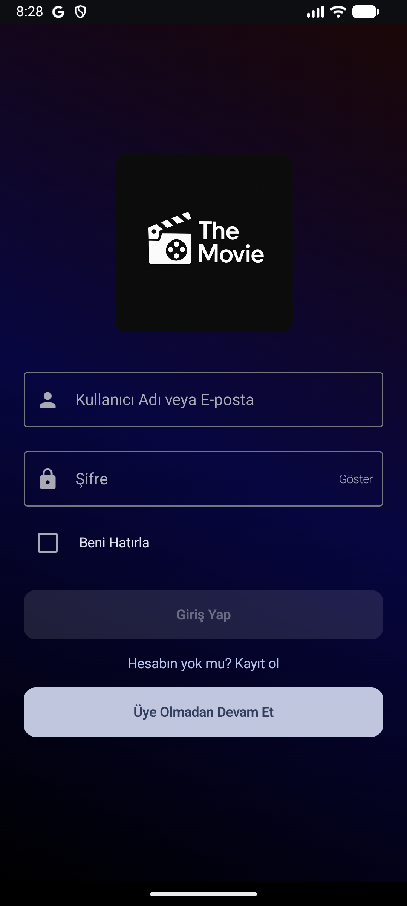 | 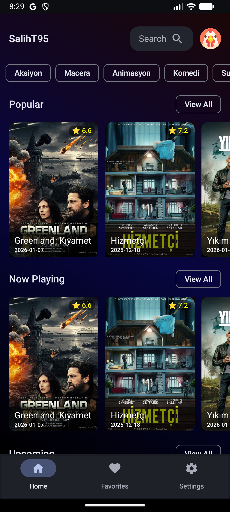 | 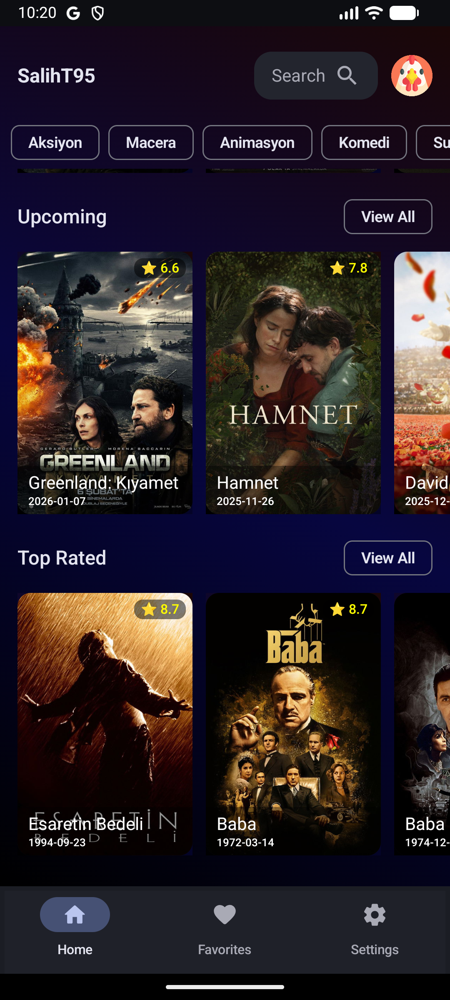 |  |

| Popüler Listesi | | | |
|:---:|:---:|:---:|:---:|
|  | | | |

### 2. Film ve Oyuncu Detayları
Film hakkında özet, puan ve oyuncu kadrosu bilgileri. Oyuncuların üzerine tıklandığında detaylı **Biyografi ve Filmografi** sayfaları açılır.

| Film Detayı (Avatar) | Oyuncu: Sam Worthington | Oyuncu: Chris Evans |
|:---:|:---:|:---:|
| 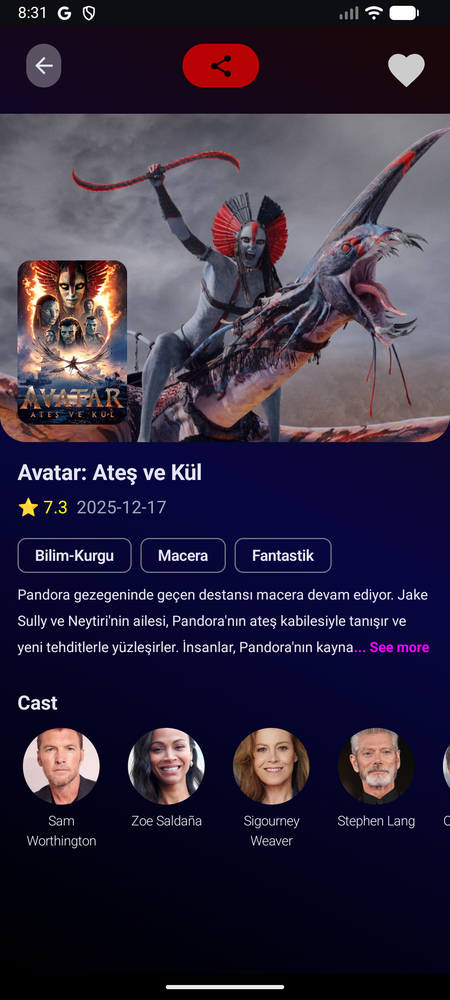 | 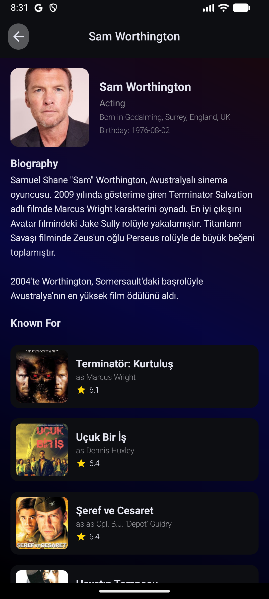 | 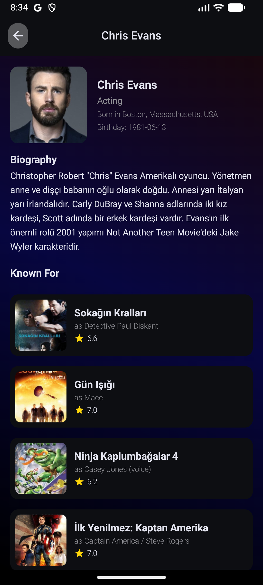 |

| Film Detayı (Komedi) | | |
|:---:|:---:|:---:|
| 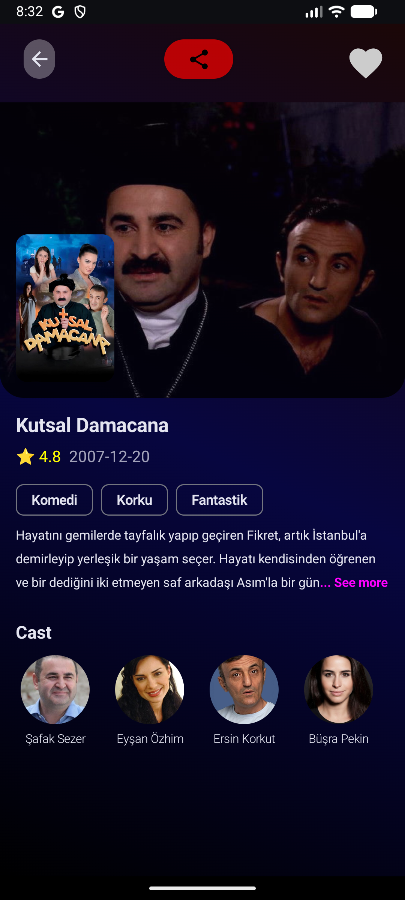 | | |

### 3. Arama Deneyimi
Kullanıcı yazmaya başladığı anda çalışan dinamik arama ve veri yüklenirken gösterilen **Skeleton (Kemik)** yükleme animasyonları.

| Skeleton Loading | Arama Sonuçları | Canlı Demo |
|:---:|:---:|:---:|
| 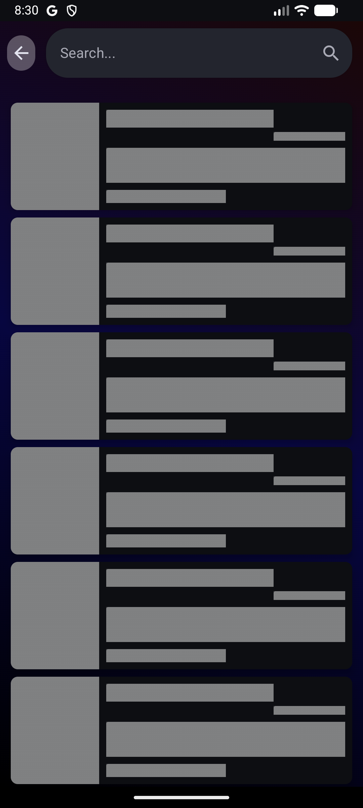 | 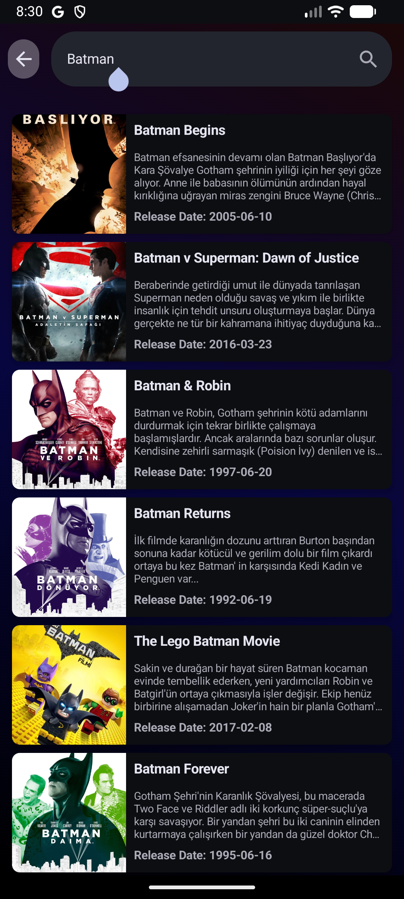 | **[▶️ Videoyu İzle](Screenshots/Screen_recording_youtube.webm)**<br>*(Uygulama Akış Videosu)* |

### 4. Profil ve Kişiselleştirme
Kullanıcılar favori filmlerini kaydedebilir, **Avatar** galerisinden profil resmi seçebilir ve hesaplarını yönetebilirler.

| Profil & Ayarlar | Avatar Seçimi | Favorilerim |
|:---:|:---:|:---:|
| 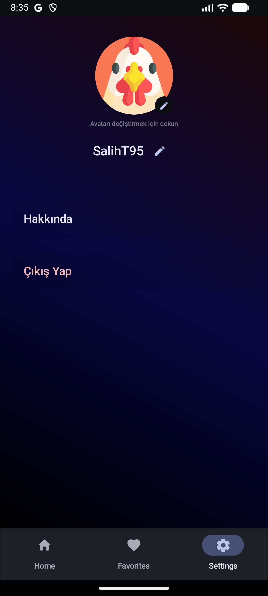 | 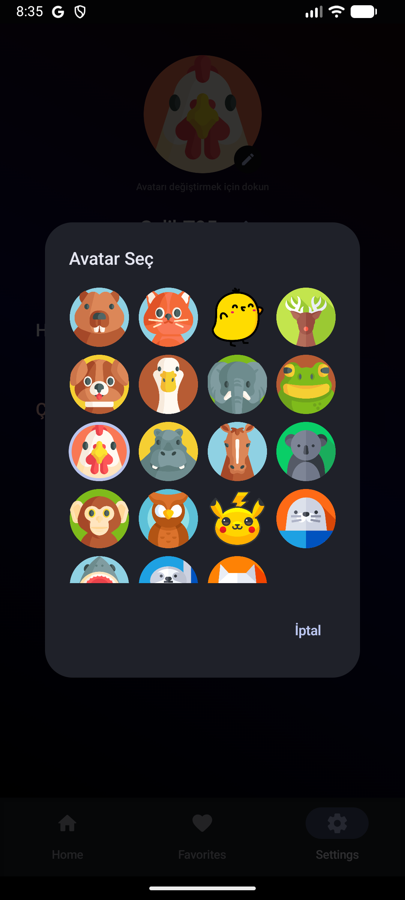 | 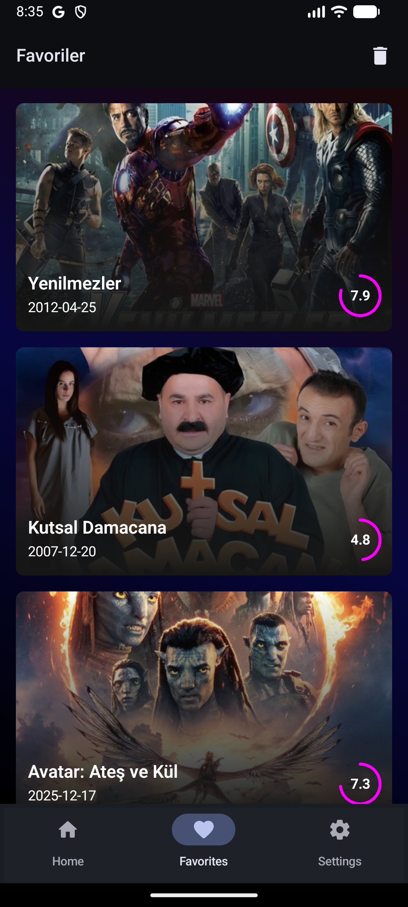 |

### 5. Uygulama Hakkında
Geliştirici bilgileri ve kullanılan teknolojilerin özeti.

| Hakkında Ekranı |
|:---:|
| 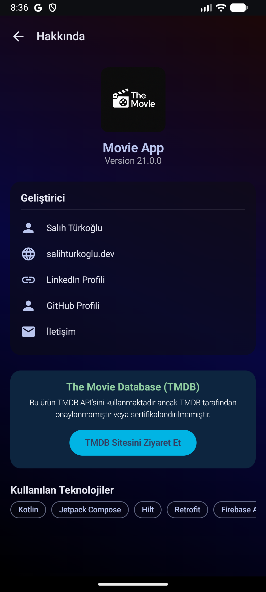 |

---

## ✨ Temel Özellikler

* **Modern UI:** Tamamen **Jetpack Compose** (Material 3) ile geliştirilmiş akıcı arayüzler.
* **Kapsamlı Veri:** Filmler, türler, oyuncu biyografileri ve filmografileri.
* **Kişiselleştirme:**
    * **Favoriler:** Beğenilen filmleri listeye ekleme/çıkarma.
    * **Avatar:** Hazır galeri üzerinden eğlenceli profil resmi seçimi.
    * **Profil Düzenleme:** Kullanıcı adı güncelleme.
* **Gelişmiş Arama:** Anlık arama ve Skeleton loading efektleri.
* **Firebase Entegrasyonu:**
    * **Auth:** Email/Şifre ile güvenli giriş.
    * **Firestore:** Kullanıcı verilerinin (Favoriler, Profil) bulutta saklanması.
* **Misafir Girişi:** Üye olmadan uygulamayı keşfetme imkanı.

## 🛠️ Teknoloji Yığını (Tech Stack)

Proje, endüstri standartlarına uygun modern kütüphanelerle geliştirilmiştir:

* **Dil:** Kotlin (%100)
* **UI Toolkit:** **Jetpack Compose** (No XML)
* **Mimari:** Clean Architecture & MVVM
* **Asenkron İşlemler:** Coroutines & Flow
* **Ağ (Network):** Retrofit & OkHttp
* **Görsel Yükleme:** Coil
* **Dependency Injection:** Hilt
* **Navigasyon:** Jetpack Navigation Compose
* **Veri Tabanı (Local):** Room Database
* **Backend:** Firebase (Authentication, Firestore)

## 🚀 Kurulum

Projeyi yerel ortamınızda çalıştırmak için:

1.  Repoyu klonlayın:
    ```bash
    git clone [https://github.com/SalihT95/MovieAppCompose.git](https://github.com/SalihT95/MovieAppCompose.git)
    ```
2.  Android Studio ile projeyi açın.
3.  Gradle senkronizasyonunun tamamlanmasını bekleyin.
4.  **Önemli:** TMDB API anahtarınızı `local.properties` dosyasına ekleyin:
    ```properties
    tmdb_api_key="SENIN_API_ANAHTARIN"
    ```
5.  Uygulamayı çalıştırın!

## 📞 İletişim

**Geliştirici:** Salih Türkoğlu
* 📧 Email: [turkoglusalih00@gmail.com](mailto:turkoglusalih00@gmail.com)
* 💻 GitHub: [@SalihT95](https://github.com/SalihT95)
* 🌐 Web: [salihturkoglu.dev](https://salihturkoglu.dev)
* 🔗 LinkedIn: [Profilim](https://linkedin.com/in/salihturkoglu)

---
*Bu proje açık kaynaklıdır ve eğitim amaçlı geliştirilmiştir.*
